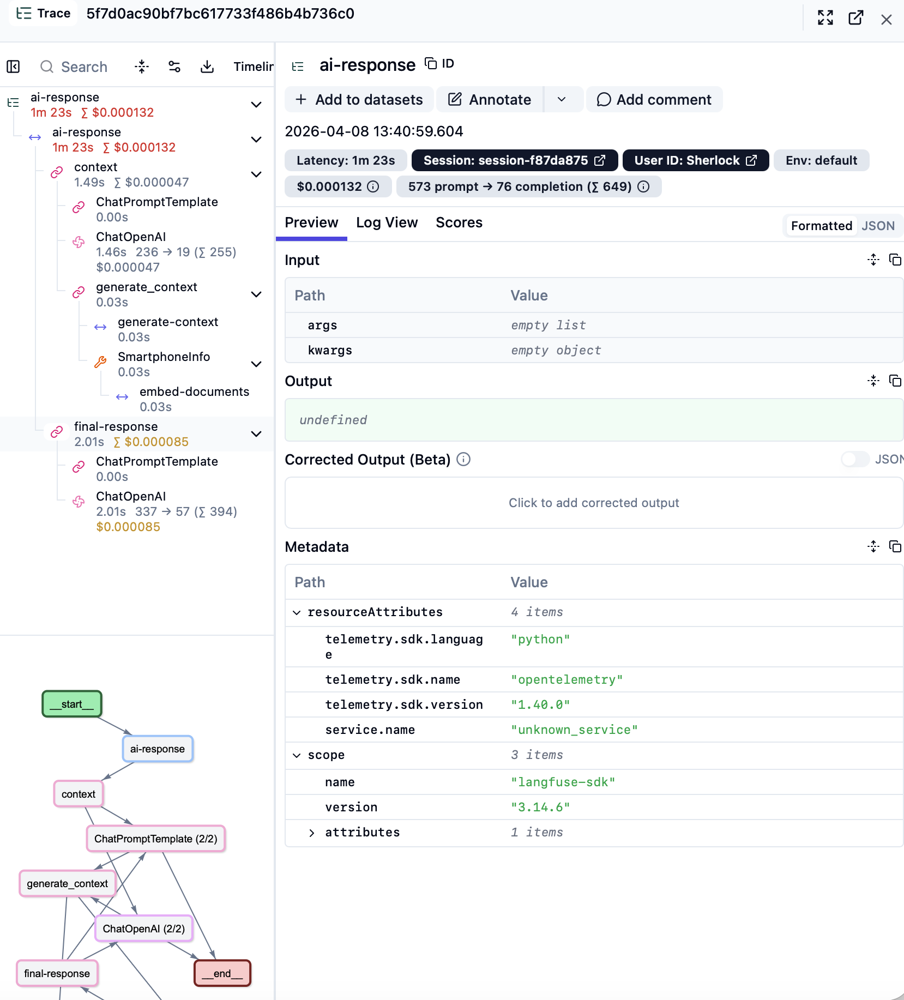
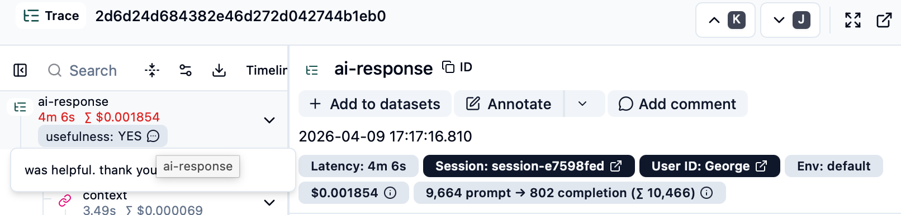
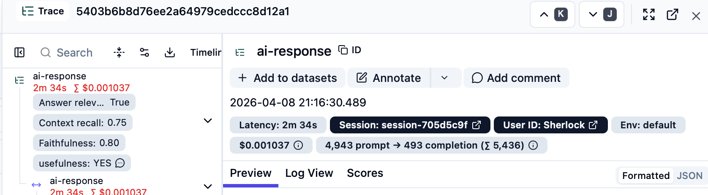
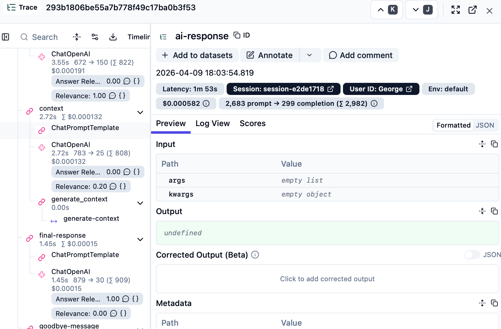

# General

Eval's a very important topic from my perspective which you don't here too much about. I appreciated the step by step apporach from 
no eval, manuel annotation, to LLM-as-a-judge.

Since not every task required code changes, I will share my learning in this markdown.

# Task 1

I did have some trouble setting up langfuse. This was due to the fact, that I had langfuse (older version) already as docker
running and thought I would work out of the box and skipped the step 'git clone https://github.com/langfuse/langfuse.git'. 
Finally, I cloned the langfuse repo as mentioned, and then it was working. I surprised how huge the docker-compose.yaml file was.
In and older langfuse version I just needed langfuse alongside with a postgres DB. 

# Task 2

By adding the Langfuse CallbackHandler in combination with the observe decorator you already get a good overview of the called
function. Which parameters are send and how long it took to run. By adding the langfuse config into the LLM invocation you can increase
the level of detail and see the token count, and the LLM-tools that has been called with all details. A much deeper level of observation.

Since there are a lot of information inside the langfuse log, I think it will take some practice to master the log reading.
It is also possible to download traces and run skripts on them, which would be helpful to run standardized analysis in pipelines
to continues obverse the app.

# Task 3

Gathering feedback from the users is very important especially for systems that have stochastic components such as LLMs. 
Therefore, this task focused on gathering a categorical measure "usefulness" from the user. In addition to that, the
user can add further comments. This could help especially with the first beta tester of an app, to 
monitor the system and tweek ceratin aspects such as system promts, temperature and so on to increarse the usefulness
for the users.

# Task 4

Besides gathering feedback from the users, developers / PO's and other people from within a company can manually annotate 
the LLM responses to enrich the measures. I think this could be helpful if people are involed that have a deep domain
knowledge since they can evaluate the results much better. For instance if a RAG is to be evalute to pull the correct 
documents and so on.

I see this manual annotation as the first step during the app development. Developers and domain experts can analyse
together to the adjust the LLM to improve the user experience. 

# Task 5

As soon as an application scales it is hard to manual annotate results manully. Therefore LLM-As-A-Judge is super helpfull
to monitor the app on the various componetents and across different users. I still belive gathering direkt user feedback as mentioned
is super important. So the combination of diretc user feedback and LLM-As-A-Judge is a very good combination
to increase the app stability and to improve the user experience.

# Summary

This was a very good projects which was really eye-opening in terms the possibilities of logging and evaluation of an LLM application.
Creating a cool and great app for the user is only achievable, if you track the app in order to make adjustment
where they are needed.